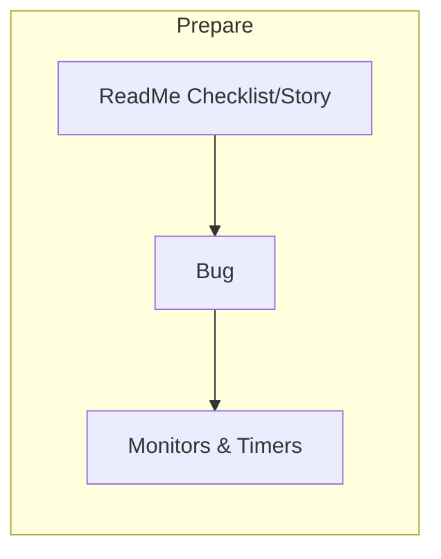
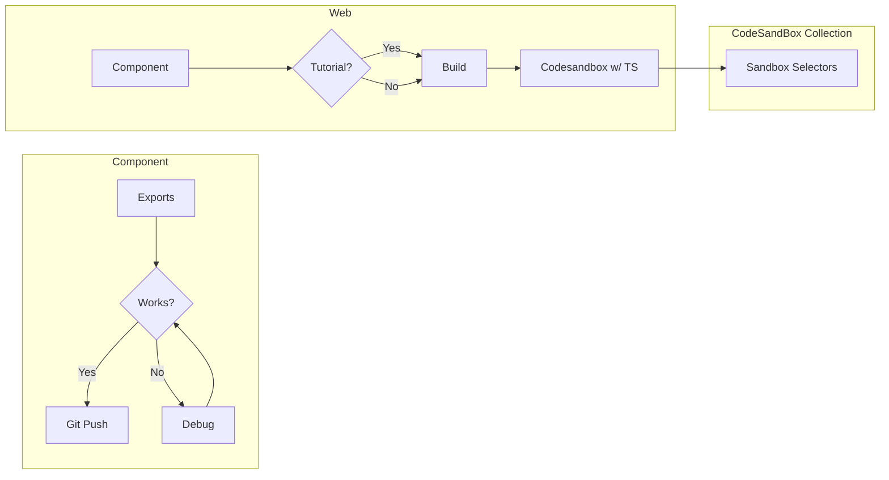

# Component Building
#### ALWAYS - SETUP 
##### Principles: ASK HOW AND WHEN 
- Make everything as modular as possible 
- Everything documented on lezzles.github.io 
- Always track on bugs 

#### Step 1: Component Process (Frontend2) 
##### Always do set up and timer 

## Web Flow

### Shortcuts
#### select section to copy and paste 
- Hold down command and drag things into the div block
- Name a new class 
	- Essentially just make sure you create a new class before you start making changes
- Option and drag the box to affect both sides 
- See in the navbar on the right 

 #### Component
##### Classes
##### Setup
##### Options

### Components
#### Units 

#### Layouts
- use grid, generally
- unless horizontally or vertically, use flex
##### Classes
.grid__wrapper
##### Setup
##### Options
#### Button - option and drag for
##### Classes
.signup__google__button
.main__button
##### Setup
States when you click on selector dropdown 
##### Options

#### Typography
##### Classes
.global__font

##### Setup
##### Options

#### Buttons
##### Classes
.
##### Setup
##### States

#### Organization 
- See in the navbar on the right 

#### Navbar
##### Classes
navbar__wrapper
navbar__logo__wrapper
nav__link

##### Setup
- Drag navbar into the panel 
- Can add brand link
- Can add menu (wrapper) 
- Can add navlink (make sure you add a class) 
- To add on other pages: 
	- Hover, and then right click on the tag, create a symbol. You an do add, select from symbol areas and then drag it anywhere you
##### Options
- Fixed 
- 
##### navbar__wrapper
##### navbar__link
- Menu item to adjust for all views (like the hamburger) 
##### Styling
- Choose a background color
- Go to tablet 
- Style the menu accordingly 
- Set background 

### CSS

### Types 
##### Flexbox
- Set properties on the parent element 

#### One Component Layouts - To Center Something (usually about parent setting rules and children following it) 
- Enable flex (the display) 
- Then click on align and justify 

#### Grid
- Great for two dimensional layouts (setting columns and rows) 

- 

## Exports

## Common Mistakes

All your files and folders are presented as a tree in the file explorer. You can switch from one to another by clicking a file in the tree.

## 

You can rename the current file by clicking the file name in the navigation bar or by clicking the **Rename** button in the file explorer.
