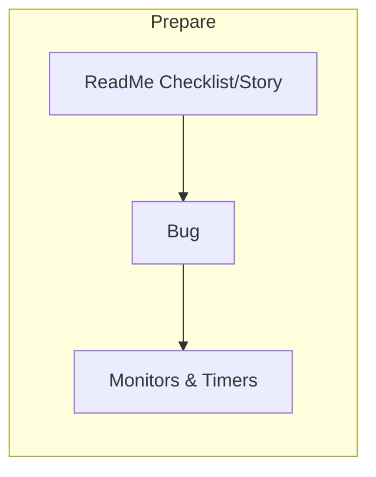
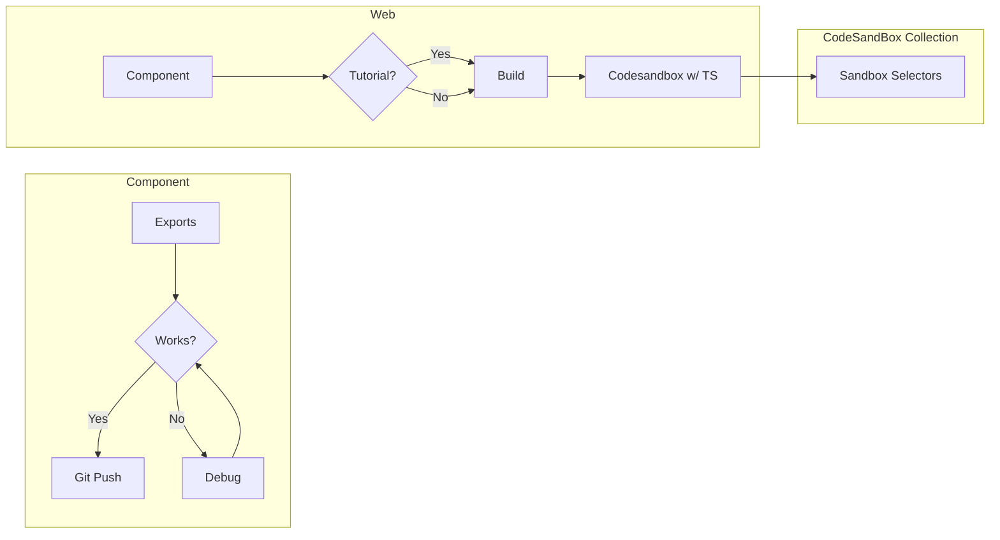
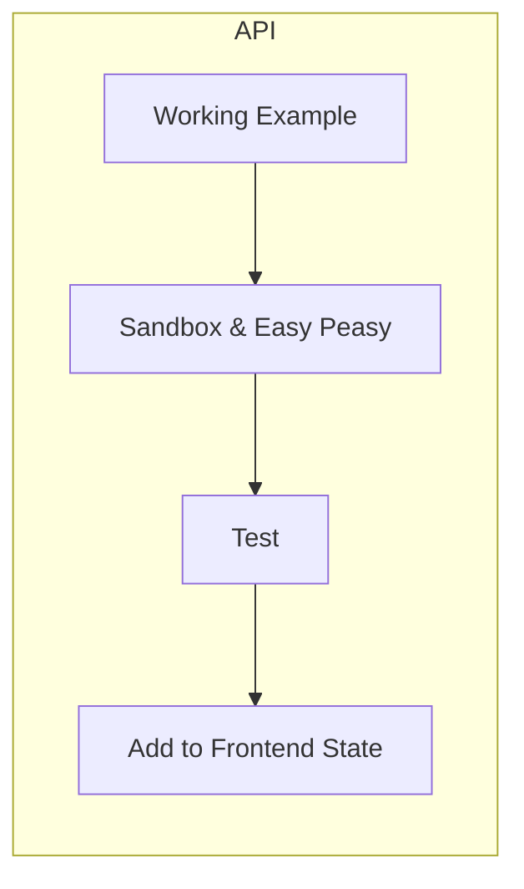
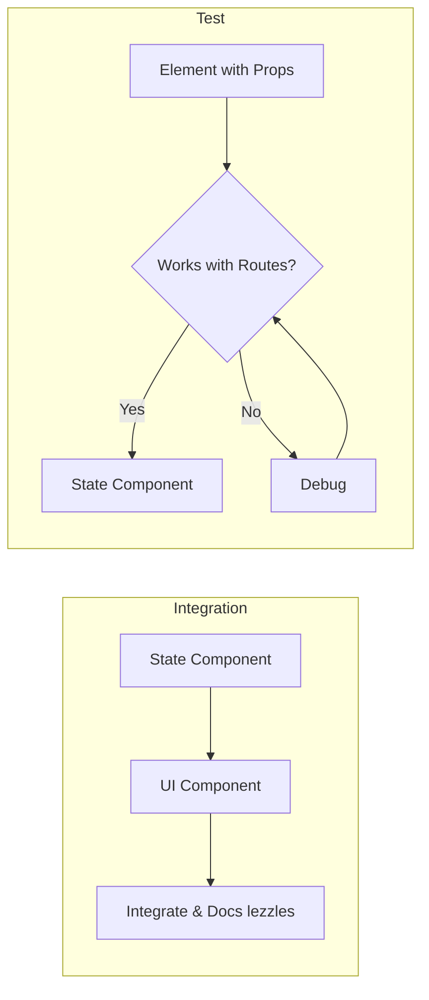

# The Price of My Life
#### ALWAYS - SETUP 
##### Principles 
- Make everything as modular as possible 
- Everything documented on lezzles.github.io 
- 

#### Step 1: Component Process (Frontend2) 
##### Always do set up and timer 

#### Step 2: API (Typescript)
##### Always do set up and timer 
Testing is important here because data can be inaccurate

#### Step 3:  State (FrontendState) 
##### Always do set up and timer 

#### Step 4:  Database (Backend) 
##### Always do set up and timer 

